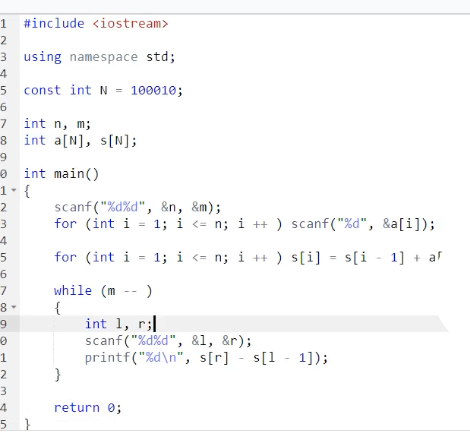

### 前缀和
- 原理：一次运算，就可以算出任意一段区间的和，非常节省时间

```c++
#include <iostream>
using namespace std;
const int N = 100010;
int n, m;
int a[N], s[N];

int main()
{
    scanf("%d%d", &n, &m);
    for(int i = 1; i <= n; i ++) scanf("%d", &a[i]);
    s[0] = 0, a[0] = 0;
    for(int i = 1; i <= n ; i++) s[i] = s[i - 1] + a[i];
    while(m--){
        int l, r;
        scanf("%d%d", &l, &r);
        printf("%d", s[r] - s[l - 1]);
    }
    return 0;
}


```