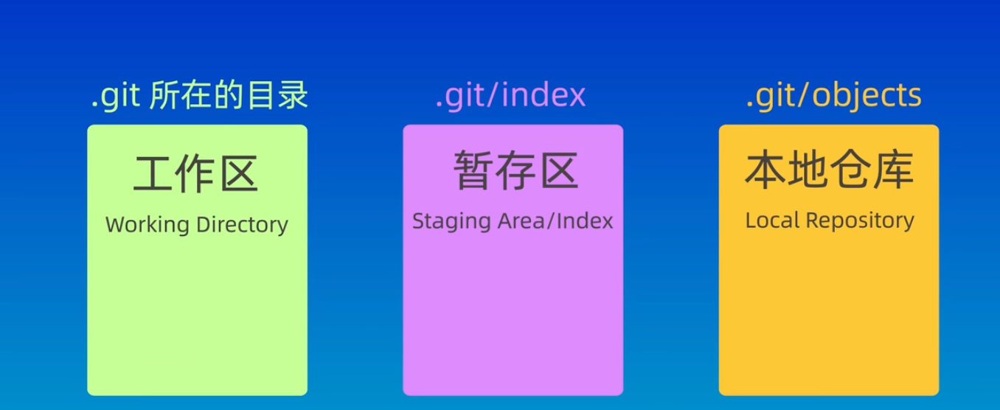

### git常用命令
- 保存用户名和邮箱

`git config --global credential.helper store`
- 查看配置信息：

`git config --global --list`
- 初始化一个本地仓库为git仓库
- 首先本地电脑创建一个文件夹，进入文件夹后执行如下命令：

    `git init`
- 查看是否有隐藏文件.git
  
    `ls -a` 
- git的基础理论知识

- git status：查看当前处于哪个分支，有哪些文件以及这些文件都处于什么状态
