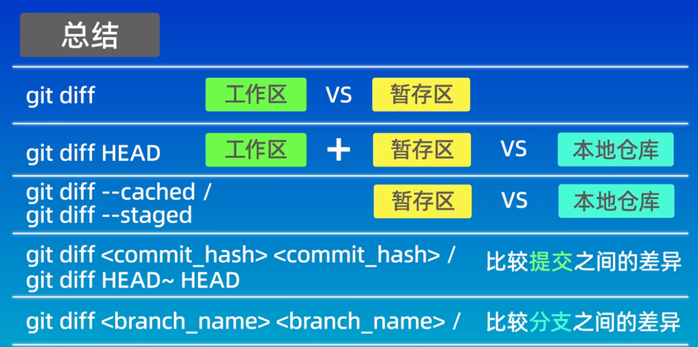

### git常用命令
- 保存用户名和邮箱

`git config --global credential.helper store`
- 查看配置信息：

`git config --global --list`
- 初始化一个本地仓库为git仓库
- 首先本地电脑创建一个文件夹，进入文件夹后执行如下命令：

    `git init`
- 查看是否有隐藏文件.git
  
    `ls -a` 
- git的基础理论知识

- `git status`：查看当前处于哪个分支，有哪些文件以及这些文件都处于什么状态
- `git add`: 将当前处于工作区的文件添加到暂存区（就是生产的货物/代码上传到货车上/暂存区）
- `git commit`：将位于暂存区的文件（货车上拉的货物）放到本地仓库里（卸货），需要注意的是commit只会提交暂存区的文件，而不会提交工作区的文件。
- 本地仓库（只有上传到本地仓库，文件才能被git管理）
- `git log`：查看提交记录
  - `git log` --oneline查看简洁的提交结果
- `git reset`：回退到某个版本
  - `--soft`  回退后，保留工作区和暂存区内容
  - `--hard`  回退后，不保留工作区和暂存区内容
  - `--mixed`

- `git ls-files`：查看暂存区的内容
- `git reflog` 查看操作的历史记录
- `git diff` 默认比较工组区和暂存区之间文件的差异

- `git diff HEAD` 比较工作区和版本控制的差异（本地仓库）。head指向分支最新提交的节点。head的上一个版本：HEAD^ or HEAD~;head之前的两个版本：head～2
- `git diff --cached` 比较暂存区和版本控制的差异
- `git diff 版本号1 版本号2` 比较两个版本的差异

- `git rm`命令
